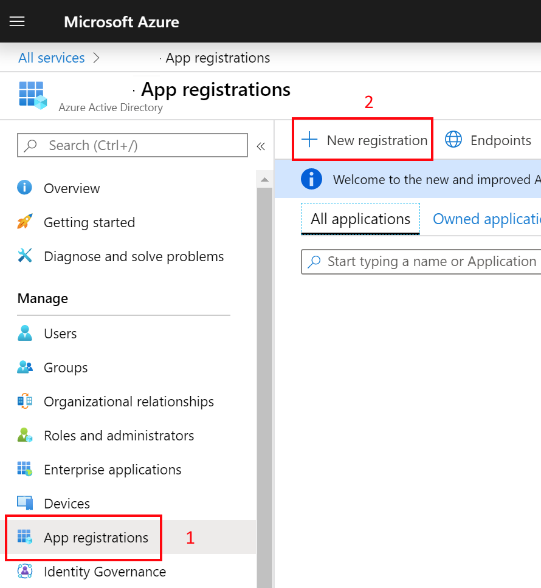
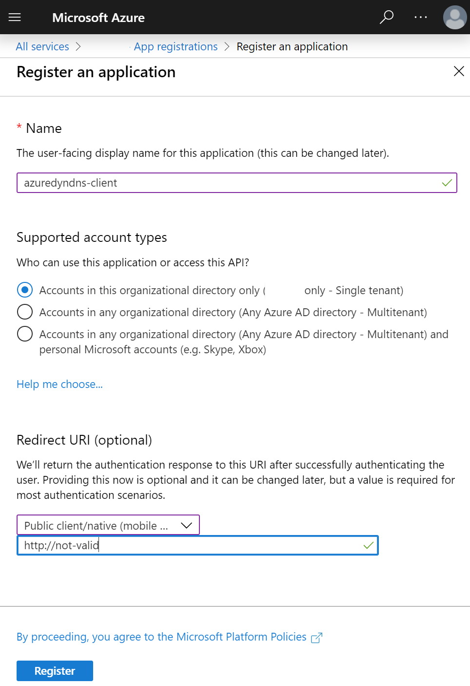
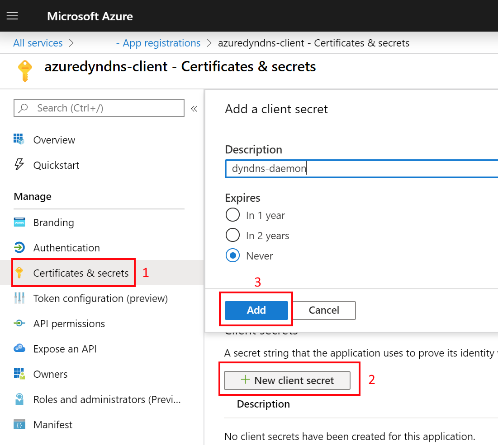
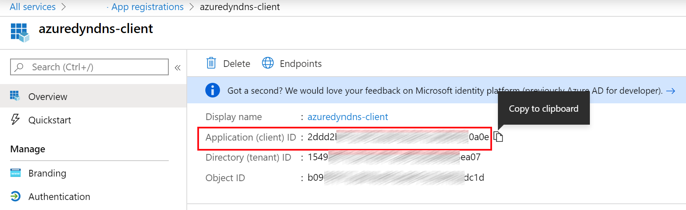
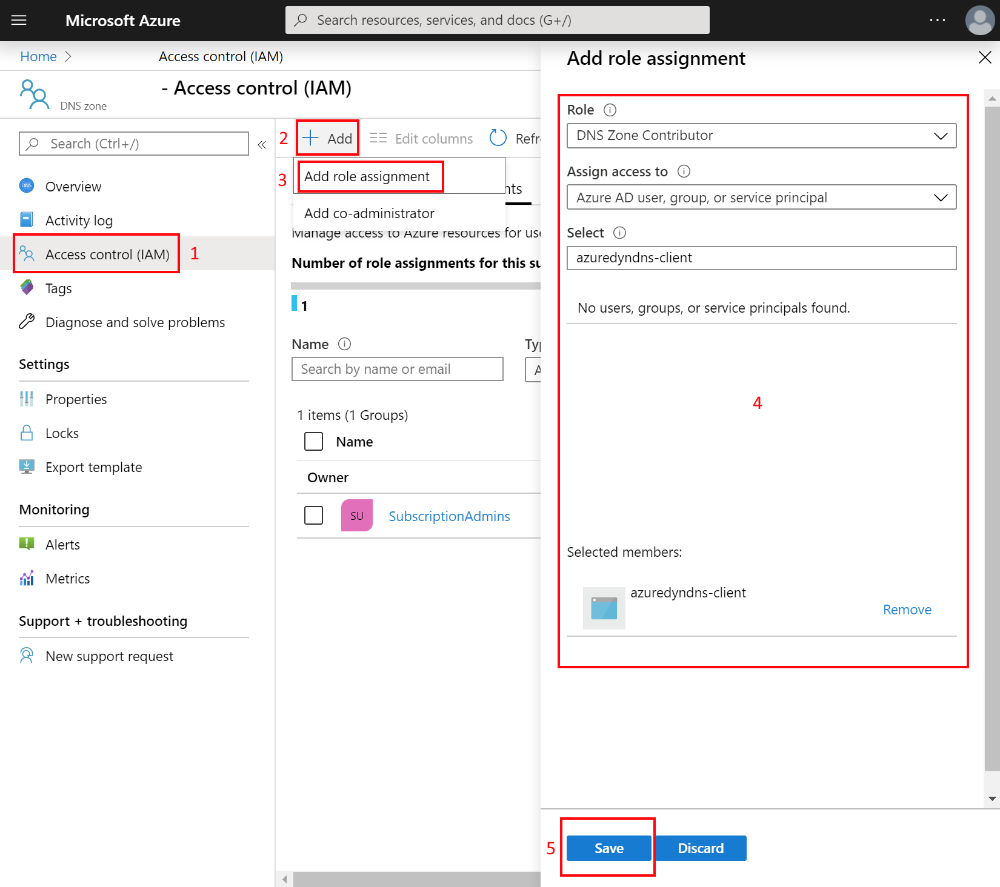
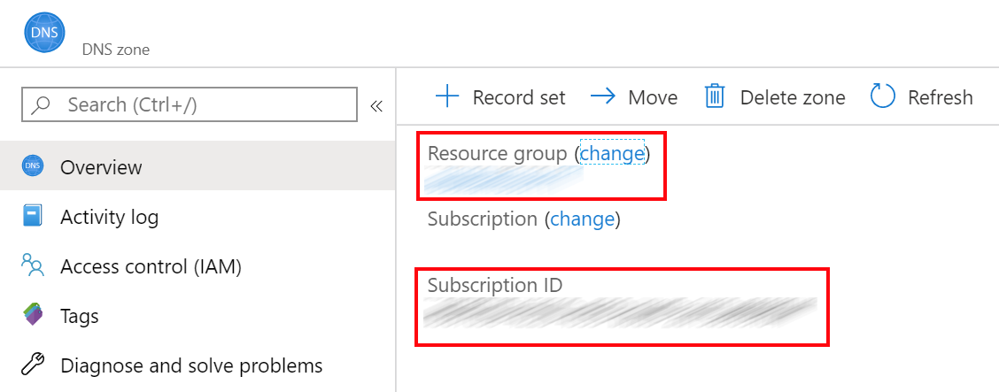

# AzureDynDNS

An Azure based DynDNS alternative.


[](https://lgtm.com/projects/g/dodekanisou/AzureDynDNS/alerts/)

Utilizing the [public IP Address API](https://www.ipify.org/) this daemon .net
core 3.1 console application retrieves the public IP that the device has. Using
that IP, the daemon updates the A record in the Azure DNS service registered in
the configuration.

## Setup instructions

Deploy an Azure DNS zone using either the portal or an
[ARM template](https://github.com/Azure/azure-quickstart-templates/tree/master/101-azure-dns-new-zone).

Go to the Azure Active Directory and create a new app registration.


Name the new application `azuredyndns-client` and specify a non valid url in the
redirect uri. 

Go to the **Certificates & Secrets** and generate a new secret. Copy that secret
in the `ClientSecret` property of the `appsettings.json`.


> It's advised to reset your credentials on a regular basis to avoid accidental
> credential leak attacks. This is why it's not advised to select the never
> option that is show in the above screen shot.

Go to the new application's overview page and copy the following fields to the
corresponding properties of the `appsettings.json`:

- **Application (client) ID** -> ClientId
- **Directory (tenant) ID** -> TenantId



Go to the provisioned Azure DNS zone and give **DNS Zone Contributor** to the
`azuredyndns-client` application.


Go to the Azure DNS zone overview and copy the following fields to the
properties of the `appsettings.json`:

- **Resource group** -> ResourceGroupName
- **Subscription ID** -> SubscriptionId
  

Your `appsettings.json` file should look like the following (GUIDs are randomly
generated in the following example using
[this tool](https://www.guidgenerator.com/online-guid-generator.aspx)):

```json
{
  "Settings": {
    "ClientId": "64ace103-cdc0-404f-8f0b-a0abcc32d3e7",
    "ClientSecret": "thisisapassword",
    "TenantId": "d6a3e0ee-99a9-4fd2-bc92-7b92d915e835",
    "SubscriptionId": "78f42174-ec57-4a87-a6b5-d803f9fb3790",
    "ResourceGroupName": "dyndns-rg",
    "DnsZoneName": "zone.contoso.com",
    "ARecordName": "dynamic",
    "ARecordTTL": 60,
    "IpifyServiceAddress": ""
  }
}
```

## Run in RPI on ubuntu

Publish the console application.

Zip the contents of `bin\Release\netcoreapp3.1\publish` and transfer the zip
file in the RPI.

Unzip the zip into `/var/lib/azureDynDns`.

```bash
sudo unzip publish.zip -d /var/lib/azureDynDns
```

Ensure that the AzureDynDns executable has the required execute permission:

```bash
sudo chmod +x /var/lib/azureDynDns/AzureDynDns
```

Add an `appsettings.json` file next to the executable:

```bash
sudo nano /var/lib/azureDynDns/appsettings.json
```

with the settings that you gathered from the guide above:

```json
{
  "Settings": {
    "ClientId": "64ace103-cdc0-404f-8f0b-a0abcc32d3e7",
    "ClientSecret": "thisisapassword",
    "TenantId": "d6a3e0ee-99a9-4fd2-bc92-7b92d915e835",
    "SubscriptionId": "78f42174-ec57-4a87-a6b5-d803f9fb3790",
    "ResourceGroupName": "dyndns-rg",
    "DnsZoneName": "zone.contoso.com",
    "ARecordName": "dynamic",
    "ARecordTTL": 60,
    "IpifyServiceAddress": ""
  }
}
```

Create a new service definition file:

```bash
sudo nano /etc/systemd/system/azureDynDns.service
```

with the following content:

```ini
[Unit]
Description=Azure DynDNS service to update the A Record with the current IP

[Service]
Type=simple
ExecStart=sudo /var/lib/azureDynDns/AzureDynDns
WorkingDirectory=/var/lib/azureDynDns/
Environment=DOTNET_USER_SECRETS_FALLBACK_DIR=/var/lib/azureDynDns/

[Install]
WantedBy=multi-user.target
```

Create a new timer definition file:

```bash
sudo nano /etc/systemd/system/azureDynDns.timer
```

with the following content:

```ini
[Unit]
Description=Run Azure DynDNS every half an hour

[Timer]
OnCalendar=*-*-* *:00,30:00
Unit=azureDynDns.service
Persistent=true

[Install]
WantedBy=timers.target
```

and then install the service, execute and observe status:

```bash
sudo systemctl enable azureDynDns.timer
sudo systemctl start azureDynDns.timer
sudo systemctl status azureDynDns.timer
```

> If you modify the definition files, you will need to reload the daemon by
> `sudo systemctl daemon-reload`.

If you just need to restart the service after a new deployment:

```bash
sudo systemctl start azureDynDns.timer
```

[More info on how timers works](https://www.certdepot.net/rhel7-use-systemd-timers/).
