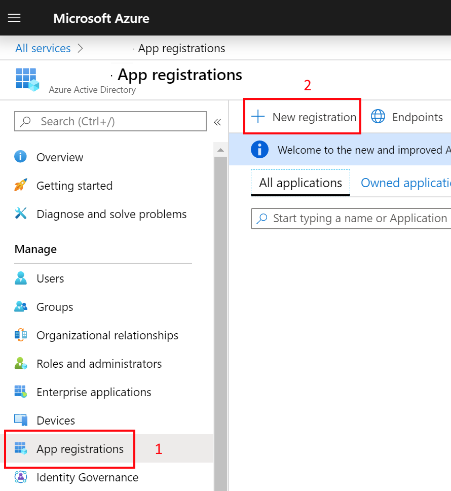
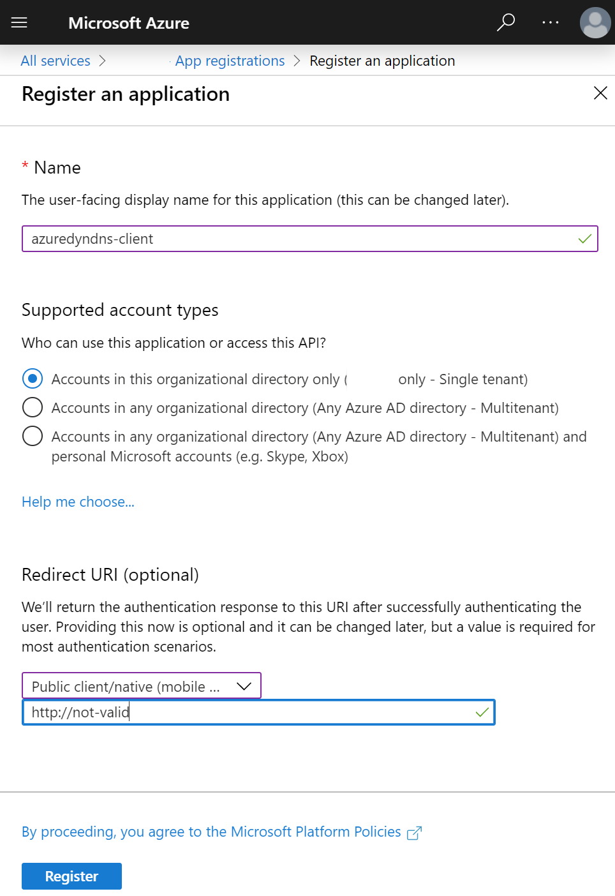
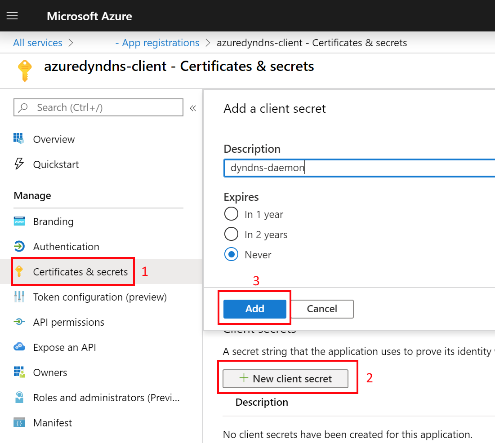
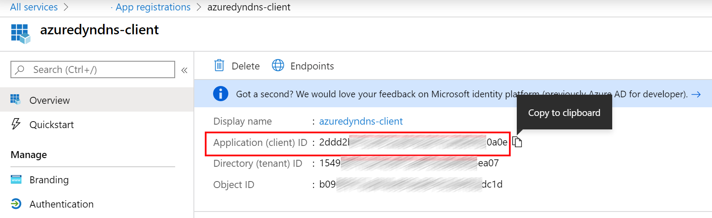
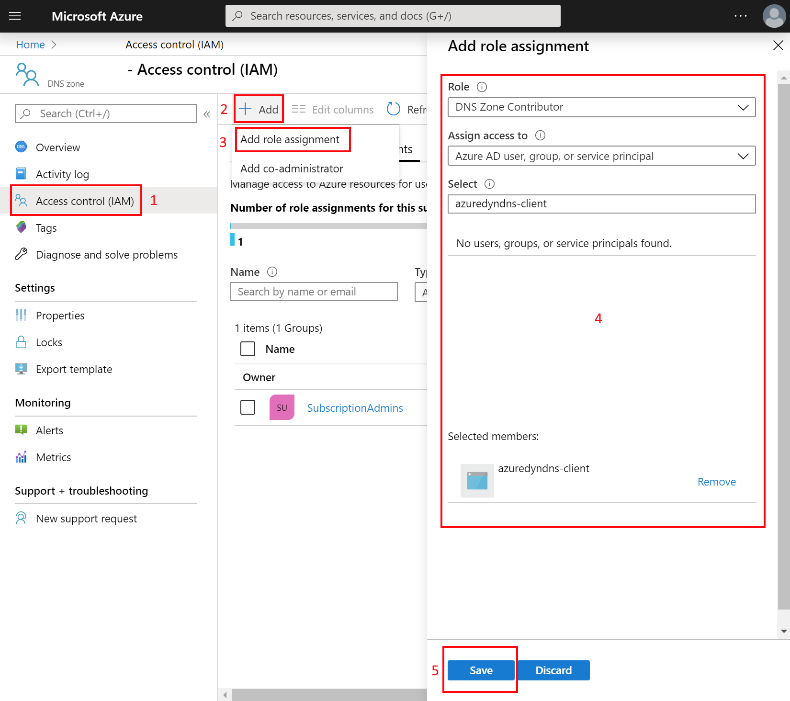
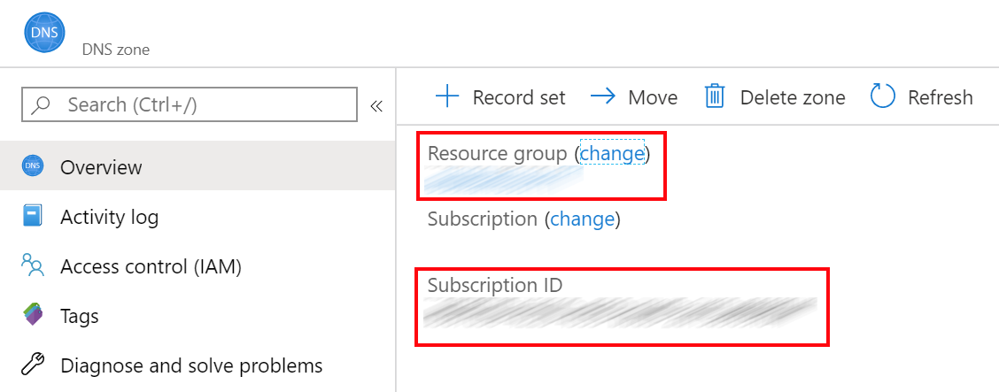

# Create AAD application and assign permissions

Go to the Azure Active Directory and create a new app registration.

Name the new application `azuredyndns-client` and specify a non valid url in the
redirect uri. 

Go to the **Certificates & Secrets** and generate a new secret. Copy that secret
in the `ClientSecret` property of the `appsettings.json`.

> It's advised to reset your credentials on a regular basis to avoid accidental
> credential leak attacks. This is why it's not advised to select the never
> option that is show in the above screen shot.

Go to the new application's overview page and copy the following fields to the
corresponding properties of the `appsettings.json`:

- **Application (client) ID** -> ClientId
- **Directory (tenant) ID** -> TenantId

Go to the provisioned Azure DNS zone and give **DNS Zone Contributor** to the
`azuredyndns-client` application.

Go to the Azure DNS zone overview and copy the following fields to the
properties of the `appsettings.json`:

- **Resource group** -> ResourceGroupName
- **Subscription ID** -> SubscriptionId
  
